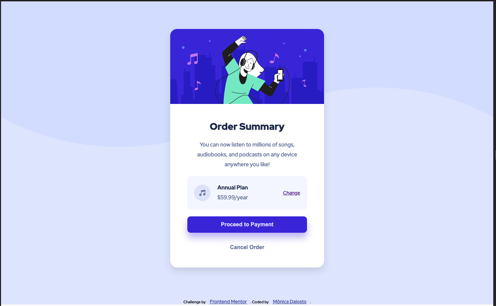
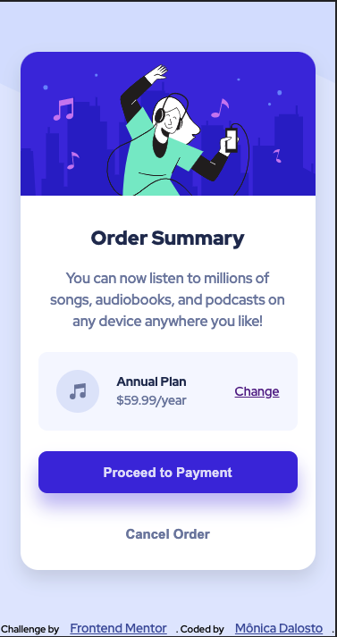

# Frontend Mentor - Order summary card solution

This is a solution to the Third challenge from Frontend Mentor. Frontend Mentor challenges is helping me  improve my coding skills by building realistic projects. 
The challenge: [Order summary card challenge on Frontend Mentor](https://www.frontendmentor.io/challenges/order-summary-component-QlPmajDUj). 

## Table of contents

- [Overview](#overview)
  - [The challenge](#the-challenge)
  - [Screenshot](#screenshot)
  - [Links](#links)
- [My process](#my-process)
  - [Built with](#built-with)
  - [What I learned](#what-i-learned)
  - [Continued development](#continued-development)
- [Author](#author)

## Overview

### The challenge

Users should be able to:

- See hover states for interactive elements
- The responsiveness on mobile screens

### Screenshot
- Desktop Screen

- Active Desktop Screen (Buttons: 'Change', 'Proceed to Payment', and 'Cancel Order')

- Mobile Screen

### Links

- Solution URL: [Order Summary Component](https://monicadalosto.github.io/frontend-mentor-challenge03-order-summary-component/)

## My process

- I started on the Html file, adding the semantic elements;
- I had imported the fonts and created some variables to identify the font-family and the colors;
- I tried to style the elements on CSS using classes instead of the html elements, so I chose the properly class names;
- The project is desktop first (screen: 1440px);
- I had used Flexbox to position the elements on the screen, before I started the stylization;
- Then I styled the elements from the top to the bottom;
- Add the hover states;
- Add the responsiveness to the mobile screens (375px);

### Built with

- Semantic HTML5 markup
- CSS custom properties
- Flexbox

### What I learned

I've practiced how to create and use the variables in CSS and the flexbox tools;

### Continued development

- Practice more the flexbox tools;
- Learn how to code Utility Firts CSS, because I tried on this project, but didn't work so well;

## Author

- Frontend Mentor - [@MonicaDalosto](https://www.frontendmentor.io/profile/MonicaDalosto)
- Github - [@MonicaDalosto](https://github.com/MonicaDalosto)
